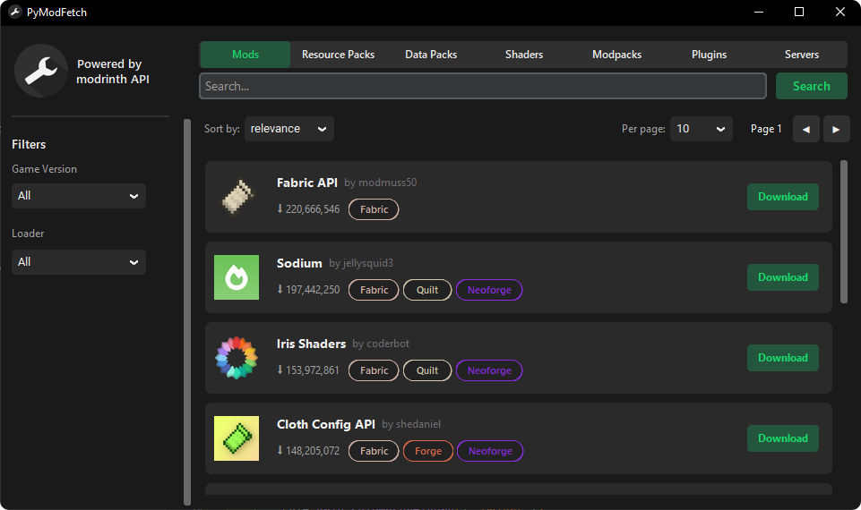

# 🔧 PyModFetch

A Modrinth client built with Python and CustomTkinter. Browse, search, filter and download Minecraft mods directly from the Modrinth API.


## ✨ Features
- Search and browse mods from the Modrinth API
- Filter by **category** (Mods, Plugins, Resource Packs, etc.)
- Filter by **Game Version** and **Loader** (Fabric, Forge, Quilt, NeoForge)
- Sort results by **Relevance** or **Downloads**
- Results display with project icon, title, author, download count and loader badges
- One-click download with progress popup and success notification

## 📸 Screenshots


## 🚀 How to Run

**Option 1 - As Python Script**
```bash
1. pip install -r requirements.txt
2. python PyModFetch.py
```

**Option 2 - Standalone Executable**

1. Download the latest `.exe` from [Releases](../../releases) and run it.

## 🛠️ Tech Stack
- Python 3
- CustomTkinter
- Requests
- Pillow (PIL)
- Standard library (threading, json, io)

## 📄 License
This project is open source and available under the MIT License.

---

*This project is not affiliated with or endorsed by Modrinth. "Modrinth" is a trademark of Rinth, Inc.*
